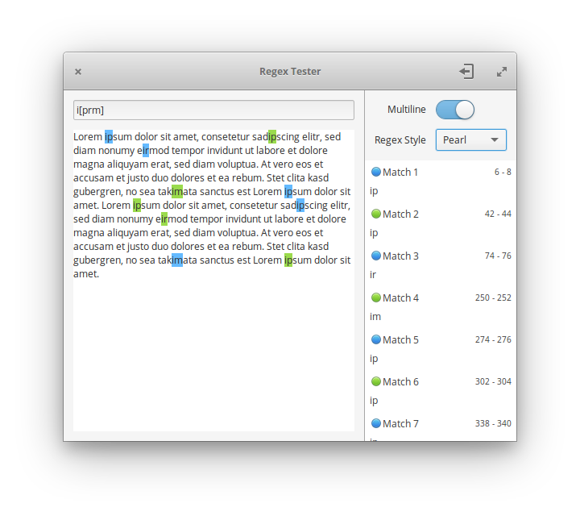

<div>
  <h1 align="center">RegEx Tester</h1>
  <h3 align="center">A simple regex tester</h3>
  <p align="center">Designed for <a href="https://elementary.io"> elementary OS</p>
</div>

### Donate
<a href="https://www.paypal.me/ArtemAnufrij">PayPal</a> | <a href="https://liberapay.com/Artem/donate">LibrePay</a> | <a href="https://www.patreon.com/ArtemAnufrij">Pareon</a>

<p align="center">
  <a href="https://appcenter.elementary.io/com.github.artemanufrij.regextester">
    
  </a>
</p>

<p align="center">

</p>

## Install from Github.

As first you need elementary SDK
```
sudo apt install elementary-sdk
```

Clone repository and change directory
```
git clone https://github.com/artemanufrij/regextester.git
cd regextester
```

Create **build** folder, compile and start Regextester
```
mkdir build
cd build
cmake -DCMAKE_INSTALL_PREFIX=/usr ..
make
./src/com.github.artemanufrij.regextester
```

(optional) Install Regextester on your system
```
sudo make install
```
