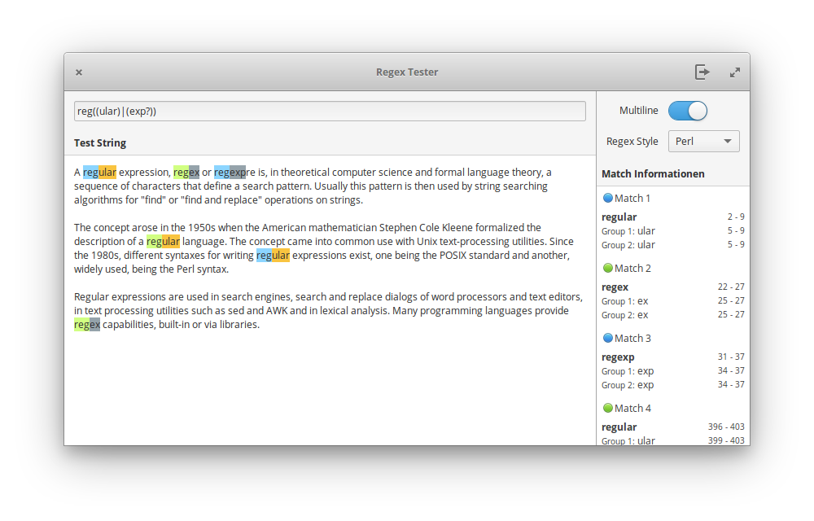

<div>
  <h1 align="center">RegEx Tester</h1>
  <h3 align="center"><br>A simple regex tester</h3>
  <p align="center">Designed for <a href="https://elementary.io"> elementary OS</p>
</div>

[](https://travis-ci.org/artemanufrij/regextester)

### Donate
<a href="https://www.paypal.me/ArtemAnufrij">PayPal</a> | <a href="https://liberapay.com/Artem/donate">LiberaPay</a> | <a href="https://www.patreon.com/ArtemAnufrij">Patreon</a>

<p align="center">
  <a href="https://appcenter.elementary.io/com.github.artemanufrij.regextester">
    
  </a>
</p>

<p align="center">

</p>

## Install from Github.

As first you need elementary SDK
```
sudo apt install elementary-sdk
```

Clone repository and change directory
```
git clone https://github.com/artemanufrij/regextester.git
cd regextester
```

Compile, install and start Regextester on your system
```
meson build --prefix=/usr
cd build
sudo ninja install
com.github.artemanufrij.regextester
```
